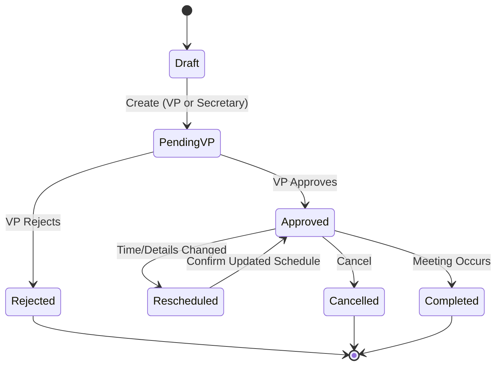
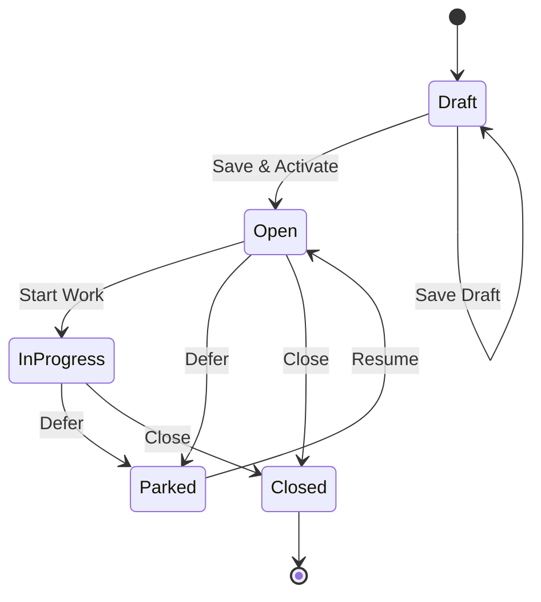
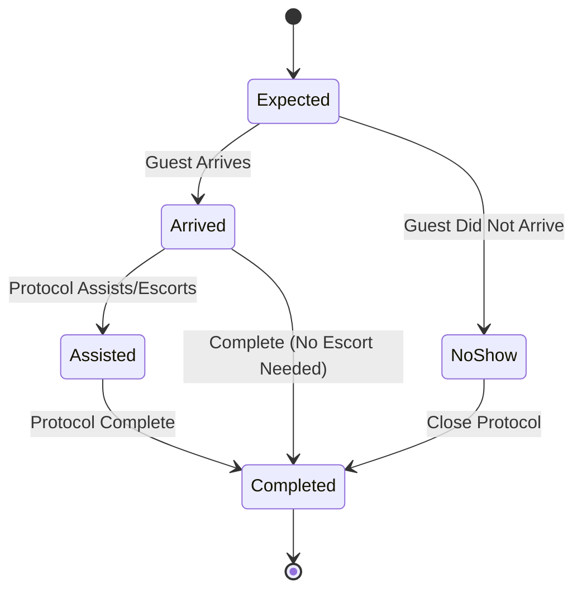
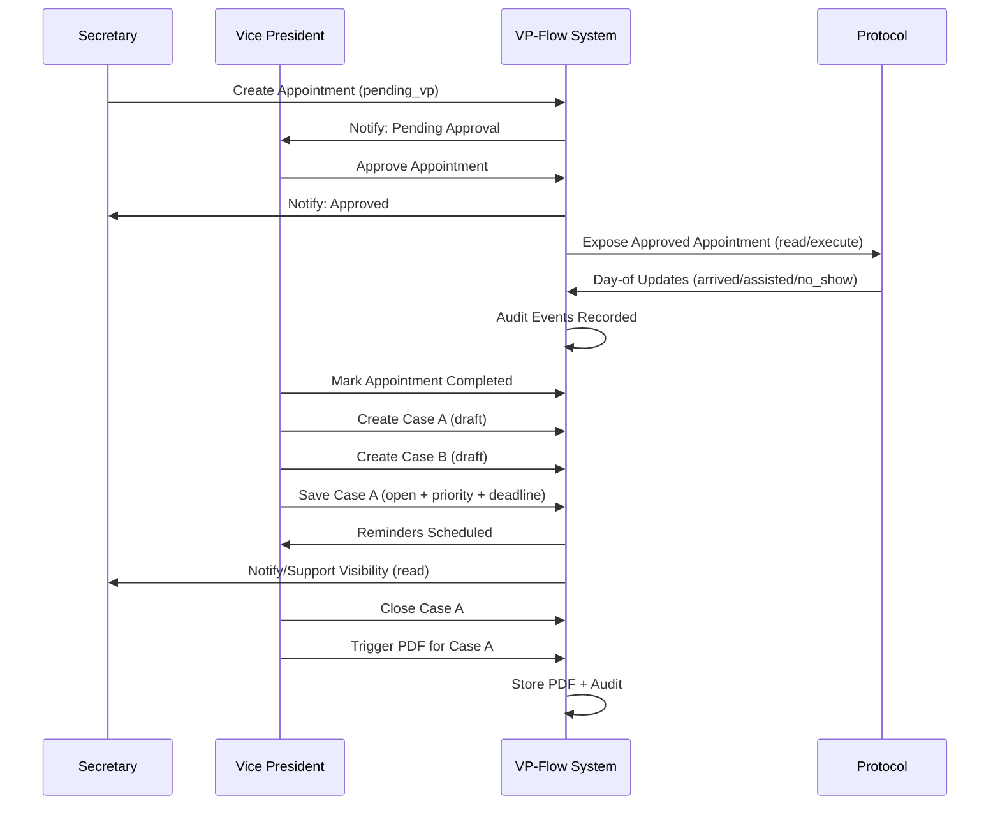

# Phase 1 – Workflow & State Diagrams (Documentation Only)

## Project
**VP-Flow**

## Status
Documentation only. No implementation authorized.

---

## 1. Mandatory Challenge (Workflow-Level)

### Weak assumption
- **Assumption:** Staff will reliably follow the VP-first confirmation rule without reverting to parallel channels (WhatsApp, email, direct calls).

### Missing constraint
- **Constraint not fully specified:** The exact **SLA / timing expectation** for VP confirmation (e.g., “within 2 hours” vs “same day”).

### Failure mode
- If confirmation is delayed and parallel channels continue, the system will not become the system-of-record, and double-booking risk returns.

---

## 2. Actors & Swimlanes

- **VP** (final authority)
- **Secretary** (create + support + reminders + comms on VP instruction)
- **Protocol** (read/execute for approved appointments)
- **System** (notifications, audit, optional Google Calendar sync)

---

## 3. Appointment Workflow (End-to-End)

### 3.1 High-level Process
1. Appointment is created (by VP or Secretary)
2. Appointment enters **Pending VP Confirmation**
3. VP **Approves** or **Rejects**
4. If approved: appointment becomes **Scheduled**
5. Protocol receives execute-view for day-of handling
6. After meeting: appointment marked **Completed** (and optionally cases are created)

### 3.2 Swimlane Workflow (Text)

**Secretary creates appointment**
- Create appointment → status = `pending_vp`
- System writes audit event
- System notifies VP (in-app)

**VP creates appointment**
- Create appointment → status = `pending_vp`
- System writes audit event

**VP decision**
- Approve → status = `approved`
  - System writes audit event
  - System notifies Secretary
  - System exposes appointment to Protocol
  - Optional: sync to Google Calendar (if enabled)
- Reject → status = `rejected`
  - System writes audit event
  - System notifies Secretary

**Reschedule / Cancel (after approval)**
- VP (or Secretary if permitted for scheduling edits) updates time → status = `rescheduled` (or remains `approved` with updated time)
- System writes audit event
- System notifies Protocol of changes
- Optional: update Google event (if enabled)

**Day-of execution**
- Protocol marks arrival / assisted / no_show
- System writes audit event(s)

**Completion**
- VP marks appointment `completed`
- VP may create cases (during or after)

---

## 4. Appointment State Diagram

### State Notes
- **Only VP** can transition `PendingVP → Approved/Rejected`.
- Protocol visibility is limited to **Approved** (and optionally Rescheduled) appointments.

---

## 5. Case Workflow (Derived from Appointments)

### 5.1 Case Creation Rules
- A case is created **only by VP**.
- A single appointment may produce **multiple cases**.
- Case splitting is allowed **during** or **after** the meeting.

### 5.2 Case Creation Flow (Text)

1. VP opens an appointment (completed or in-progress context)
2. VP clicks “Create Case”
3. System creates **Case Draft** linked to the appointment (and client)
4. VP may:
   - Write notes in editor
   - Set priority (High/Medium/Low)
   - Set deadline
   - Split into additional cases (repeat)
5. VP saves each case:
   - Draft → Open (or remains Draft if explicitly saved as Draft)
6. System schedules reminders based on priority + deadline
7. VP updates case through lifecycle until Closed
8. VP (or authorized assistant) triggers PDF generation when required

---

## 6. Case State Diagram

### State Notes
- Closed is **final**. Reopening is not allowed.
- Reminders/overdue notifications only apply when case is **Open / InProgress**.

---

## 7. Priority & Notification Behavior (Operational Rules)

### 7.1 Reminder Schedule (Documentation-Level Specification)
- **High**
  - Reminder T-7 days, T-3 days, T-1 day (configurable later)
  - Overdue alert daily until acknowledged/closed
- **Medium**
  - Reminder T-3 days
  - Overdue alert weekly
- **Low**
  - Optional reminder T-1 day
  - Overdue alert none (or monthly)

> Exact schedules may be refined, but escalation hierarchy must remain.

### 7.2 Dashboard Blocks
- High priority overdue cases: top banner
- High priority upcoming cases: top list
- Medium: standard list
- Low: separate collapsed section

---

## 8. Protocol Workflow (Read/Execute)

### 8.1 Inputs
- Approved (and rescheduled) appointments only

### 8.2 Execute Actions
- Mark arrival status
- Mark “assisted/escorted” status
- Mark no-show
- Add protocol notes (limited)

### 8.3 Protocol State Diagram

---

## 9. Integrated Sequence (Appointment → Protocol → Cases)

---

## 10. Audit Event Coverage (Workflow Triggers)

### 10.1 Appointment Audit Events
- created
- status_change (pending_vp/approved/rejected/cancelled/completed)
- rescheduled (time change)
- notes_updated

### 10.2 Case Audit Events
- created (draft)
- activated (draft → open)
- priority_changed
- deadline_changed
- status_change
- pdf_generated

### 10.3 Protocol Audit Events
- protocol_status_change
- protocol_notes_updated

---

## 11. Phase Gate Status

Phase 1 (Workflow & State Diagrams) – COMPLETE (documentation)

**Hard Stop:** Await explicit authorization for the next phase.

---

**Await Further Instructions.**

